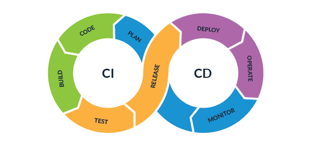
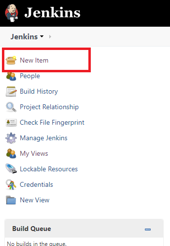
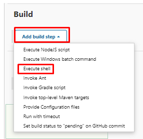
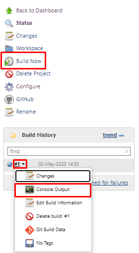
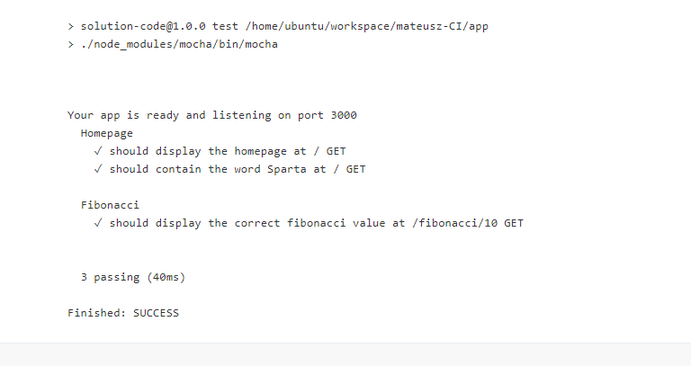

# CI/CD With Jenkins



## What is Jenkins?

- An open source automation server which enables developers around the world to reliably build, test, and deploy their software.

### Other Tools Available

- Circle CI
- GitLab
- Bamboo
- Team City
- Buddy
- Travis CI

## What is CI?

- The practice of automating the integration of code changes from multiple contributors into a single software project.

## Difference between CD & CDE?

What Continuous Delivery (CD) Does
- CD automatically deploys releases to a testing or staging environment. It requires human intervention to deploy a release from staging to production.

What Continuous Deployment (CDE) Does
- CDE automatically deploys releases from building through testing and into production. It simply checks to see all tests have past and releases it to customers.

# Running Test On Jenkins Through GitHub

## Set Up SSH Key to GitHub

1. Open your terminal window.

2. Change directory into your .ssh folder.
3. Generate a new key using the command below.
    ```
    ssh-keygen -t rsa -b 4096 -C <email address>
    ```
4. Name the key to your preference. I named mine `samuel-jenkins-key`.
5. Open your public ssh key with the command below.
    ```
    sudo cat <key-name>.pub
    ```
6. Copy your ssh key to paste into your GitHub repo.
7. Navigate to your GitHub repo and click on the settings tab.
8. Click deploy keys under security.
9. Click add deploy key.
10. Title your new key and paste your ssh key into the box below. Also, select `allow write access`.
11. Click add key in the green box and you should see your new key.

## Set Up Jenkins

1. Open Jenkins in your browser and log in.

2. Click `New Item` on the left hand side to create a new job.

    

3. Enter the name you would like to name your item. I used `samuel-CI` since we are using it for continuous intergration (CI)
4. Select `Freestyle project`
5. Click OK to create. 
6. In the `Description` box write a few lines to explain what this job is for. I entered `Building a CI for automating testing`.
7. Select `Discard old builds` box and set max number of builds to `3`

    

8. Select `GitHub project` and in the project URL and paste your GitHub repo URL using HTTPS.
    - Navigate to your GitHub repo.

    - Click `<> Code` in the green box.
    - Select HTTPS and copy the URL.

    

    - Paste the URL and paste on Jenkins.

9. Under Office 365 Connecter, select `restrict where this project can be run`. We had one set up already named `sparta-ubuntu-node`

    

10. Under source code management select git.
11. Copy your SSH URL from your GitHub repo and paste it into the `Repository URL` box.
12. Click add key and select Jenkins.
13. For the kind tab select `SSH Username with private key`.
14.	Enter the username for what you would like to name this key. (Should be the same as your ssh key you created)
15.	Select enter directly next to private key and click add.
16.	Open your terminal and open your private ssh key with the command below.
    ```
    sudo cat <key-name>
    ```
17. Copy your private ssh key and open Jenkins again. Then, paste your private ssh key in the box.
17.	Click add at the bottom to add ssh key.
18. Sele
18.	Change branches to build name from master to `main` as this is the branch on GitHub.
19.	Under `Build Environment` select `Provide Node & npm bin/ folder to PATH`. We had one created for us already.
20.	Under Build click `Add build step` and select `Execute shell`.

    

21. Enter commands to navigate to where your app is saved and run tests.
    ```
    cd app
    npm install
    npm test
    ```
22. Click `Build Now` and wait for the build history to update. When the new build shows up, click the dropdown as show below to access `Console Output` and click it.
    
    

23. Once you've clicked it, it will show everything that has run in the background and we can check to see if all tests have passed.

    

# Automate Build Proccess On Jenkins With Webhook

## Create Webhook On Github

1.	Open git hub and navigate to your repository where your app is stored.

2.	Click on the settings tab.
3.	Click on webhook and click add webhook
4.	Copy IP address from Jenkins and paste into payload url `http://35.178.11.196:8080/github-webhook/`. We used `github-webhook` at the end to show to connection we wanted to use.
5.	Select `application/json`
6.	Click `Create webhook`
7.	Open Jenkins in browser and find your job you created. Hover over your job and you will see an arrow next to it. Click the arrow and click `configure`.
8.	Scroll down to `Build triggers` and select `GitHub hook trigger`. Save the changes after.

## Test Connection From GitHub To Jenkins

1.	Open GitHub and make changes to your README.md on GitHub where you previously made the webhook.
2.	Name the commit change and commit the changes.
3.	Check Jenkins to see if it builds automatically.

## Test Connection From Local Machine To Jenkins

1.	Open your IDE and navigate to folder where you made changes on GitHub.

2.	Pull the changes you made on GitHub using `git pull <origin> <branch>`
3.	Make a change to your README.md file.
4.	Add the changes with `git add`. Commit the changes with `git commit -m “”`. Push the changes to GitHub with `git push <origin> <branch>`.
5.	Open Jenkins and it should be built automatically for you.

# Merge Code From Dev To Main Branch Through Jenkins

1. Open Jenkins in your browser and log in.

2. Click `New Item` on the left hand side to create a new job.

    

3. Enter the name you would like to name your item. I used `samuel-CI-merge` since we are using it for continuous intergration (CI)
4. Select `Freestyle project`
5. Click OK to create. 
6. In the `Description` box write a few lines to explain what this job is for. I entered `Merging dev branch with main branch`.
7. Select `Discard old builds` box and set max number of builds to `3`

    
8. Under source code management select git.
9. Copy your SSH URL from your GitHub repo and paste it into the `Repository URL` box.
10. Select your SSh key you created alrrady.
11. Change `Branches to build` name from master to `dev` as this is the branch on GitHub.
12. For `Additional behaviours` click add.
    - Name of repository = origin
    - Branch to merge to = main
    - Merge strategy = default
    - Fast-forward-ode = --ff
13. Under `Build Environment` select `Provide Node & npm bin/ folder to PATH`. We had one created for us already.
14.	Under Build click `Add build step` and select `Execute shell`.

    

15. Enter commands to navigate to where your app is saved and run tests.
    ```
    cd app
    npm install
    npm test
    ```
16. Under `Post-build actions` click `Add post-build action` and select `Git Publisher`.
17. Click save to make changes.

## Test To See If Job Works

1. Open your IDE and change directory to the same as your repo.

2. Create a new branch with the following command. `git branch dev`.
3. Change branches to your new one you created. `git checkout dev`.
4. Make changes to your code.
5. Add the changes with `git add`. Commit the changes with `git commit -m “”`. Push the changes to GitHub with `git push <origin> <branch>`.

# Push Code To Production EC2 Instance

## Launch EC2 Instance

1. Open AWS in browser and log in.

2. If you have an AMI set up already, launch a new instance from there.
3. For instance type select `t2.micro`.
4. Select a key pair you have been using previously or create a new one.
5. For network setting, when creating a new security group make sure to allow inbound rules for:
    - SSH port 22 for your IP
    - SSH port 22 for Jenkins IP
    - HTTP port 80 for 0.0.0.0
    - Custom TCP for port 3000 with 0.0.0.0
    - Custom TCP for port 8080 (Jenkins port) with 0.0.0.0
6. Click Launch instance.

## Create New Job For EC2 Instance

1. Open Jenkins in your browser and log in.

2. Click `New Item` on the left hand side to create a new job.

    
3. Enter the name you would like to for your new job.
3. Select `Freestyle project`
4. If you have already created a item, you can copy that item to save you time as seen below. If not, then skip this part. (I had one created already)


5. Click `OK` to create a new item.
6. Make sure under `Source Code Management` tab that Branches to build is set to `main`
7. Under `Build Environment` select SSH agent and select your specific credential that is linked to your .pem file.
8. Under `Build` click `Add build step` and select `Execute shell`.
9. Enter the following commands below:

```
scp -v -r -o StrictHostKeyChecking=no app/ ubuntu@<public-ip-aws>:/home/ubuntu/
ssh -A -o StrictHostKeyChecking=no ubuntu@<public-ip-aws> <<EOF
# sudo apt install clear

cd app

# sudo npm install pm2 -g
# pm2 kill
nohup node app.js > /dev/null 2>&1 &
```

10. Click save to save your changes.
11. Click build to test your job.

# Set Up Master Node For End to End Pipeline

1. Open AWS and launch a new instance.

2. Name your instance to your preference.
3. Make sure you select t.2 mediumn for instance type.
4. Make sure you have the following ports open for your security group open for your inbound rules.
    - SSH port 22 for your IP
    - SSH port 22 for Jenkins IP
    - HTTP port 80 for 0.0.0.0
    - HTTPS port 443 for 0.0.0.0
    - Custom TCP for port 3000 with 0.0.0.0
    - Custom TCP for port 8080 (Jenkins port) with 0.0.0.0
5. Launch your instance.
6. Open your terminal and SSH into your instance.
7. We need install Java onto our instance so we use the following commands:
    ```
    sudo apt update -y
    sudo apt upgrade -y
    sudo apt install default-jdk -y
    ```
8. We then need to download and install Jenkins onto our instance:
    ```
    wget -q -O - https://pkg.jenkins.io/debian-stable/jenkins.io.key | sudo apt-key add -
    sudo sh -c 'echo deb http://pkg.jenkins.io/debian-stable binary/ > /etc/apt/sources.list.d/jenkins.list'
    sudo apt-get update
    sudo apt-get install jenkins
    sudo systemctl start jenkins
    sudo systemctl enable jenkins
    ```
9. By default, Jenkins runs on port 8080, so let’s open that port using ufw: `sudo ufw allow 8080`
10. Check ufw’s status to confirm the new rules: `sudo ufw status`
    - NOTE: If the firewall is inactive, the following commands will allow OpenSSH and enable the firewall: 
    ```
    sudo ufw allow OpenSSH
    sudo ufw enable
    ```
11. To set up your installation, visit Jenkins on its default port, 8080, using your IP address: `http://instance_public_ip:8080`
12. In the terminal window use the cat command to display your password: `sudo cat /var/lib/jenkins/secrets/initialAdminPassword`
13. On the next page select `Install suggested plugins` option.
14. After this you will create your username and password.
15. Confirm your Jenkins URL is correct and click save and finish.
16. Click on `Manage Jenkins` on the left side of the page. Click on available plugins and download the following plugins:
    - Amazon EC2 Plugin
    - NodeJS Plugin
    - Office 365 Connector
    - SSH Agent Plugin
17. Once you install those plugins, clcik on `Manage Jenkins` again and click `Global Tool Configuration`.
18. Scroll down to NodeJS and click Add NodeJS.
19. Name your NodeJS. Make `Instal automatically` boxed is ticked.
20. Select the version of NodeJs you would like to install.
21. Enter the npm packge which is required. For me it was `sudo npm install pm2 -g`.
22. Save those changes and you are ready to create your first job.